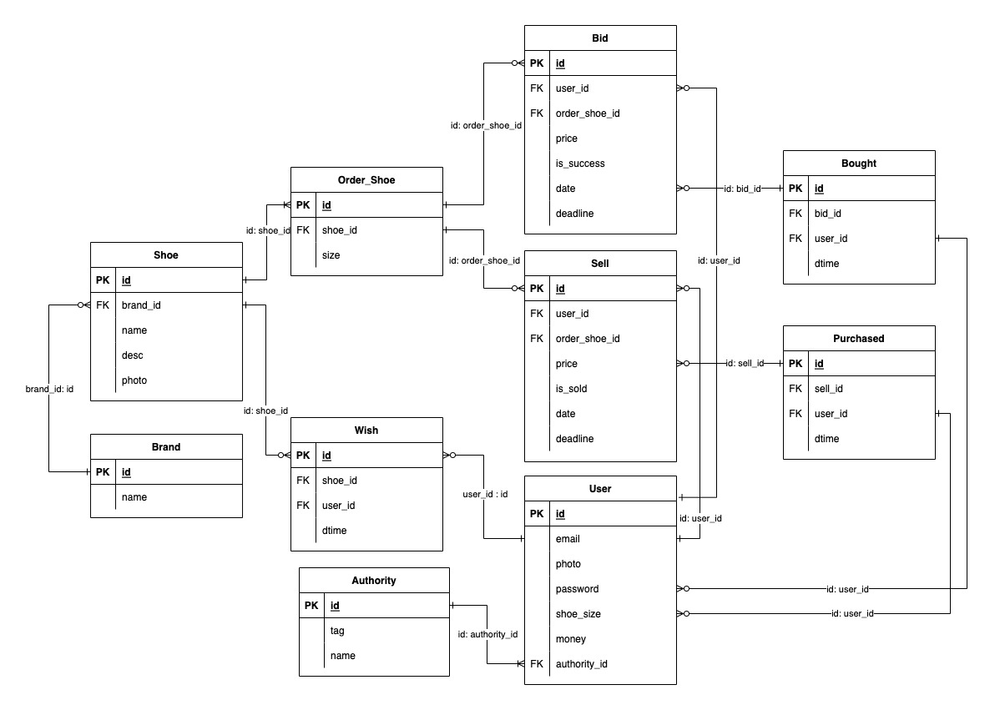

# WP-assignment

2022 first semester 
Web programming team project


## Environment

```
• IDE : IntelliJ IDEA , DataGrid

• Language : PHP 8.1.4

• Build : Gradle 7.3.2

• DataBase : mysql Ver 8.0.28

• Document : https://github.com/Dltmd202/WP-assignment
```

### Migrate

1. set configuration

> [DataBase Configuration Setting File](./conf/conf_db.php)
> set database `username`, `password`, `database`
   
2. execute ddl
   
> [ddl File](./ddl.sql) execute this query

### Run To localhost

```sh
php -S 127.0.0.1:8000
```

`php -S <yourself>:<port>` is available 

### Structure

#### Entity Relation diagram



### Project Tree

```
├── README.md
├── conf
│   └── conf_db.php
├── css
│   ├── common.css
│   ├── footer.css
│   ├── header.css
│   ├── index.css
│   ├── order.css
│   ├── price.css
│   └── user
│       ├── create.css
│       ├── login.css
│       └── user.css
├── ddl.sql
├── docs
│   └── erd.png
├── footer.php
├── header.php
├── img
│   ├── dropdownbtn.svg
│   ├── fav.png
│   ├── shoe
│   │   ├── 1.webp
│   │   ├── 2.webp
│   │   ├── 3.webp
│   │   └── 4.webp
│   ├── to_left.svg
│   ├── to_right.svg
│   └── user
│       └── base.png
├── index.php
├── js
│   ├── bid.js
│   ├── common.js
│   └── sell.js
├── order
│   ├── bid.php
│   ├── bid_action.php
│   ├── delete.php
│   ├── detail.php
│   ├── modify.php
│   ├── sell.php
│   └── sell_action.php
├── price
│   ├── create.php
│   ├── delete.php
│   ├── detail.php
│   ├── list.php
│   ├── list_header.php
│   └── modify.php
├── team.iml
└── user
    ├── charge_to_admin.php
    ├── create.php
    ├── create_action.php
    ├── login.php
    ├── login_action.php
    ├── logout.php
    ├── modify.php
    └── mypage.php


```


## Reference

* [Kream](https://kream.co.kr/)
* [PHP](https://www.php.net/docs.php)

